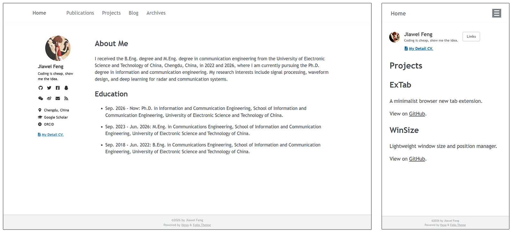

<h1 align="center">
  
  <br>
  Folio
  <br>
</h1>

<h3 align="center">
A simple academic theme for Hexo
</h3>

## Introduction

Folio is a lightweight Hexo theme designed for personal academic websites, with simple configuration and responsive layout.

## Preview

<p align="center"></p>

## Installation

Assuming your Hexo site directory is `hexo-site`, the simplest way to install this theme is to clone the entire repository:

```bash
cd hexo-site
git clone https://github.com/yetex1t/hexo-theme-folio themes/folio
```

Set theme in `hexo-site/_config.yml`:

```yml
theme: folio
```

Create `_config.folio.yml` in the `hexo-site` directory, copy the contents of `themes/folio/_config.yml` into it, and modify the configuration as needed.

## Create pages

This theme supports `post` and `page`.

Create a home page by adding `source/index.md`:

```bash
hexo new page --path index "About Me"
```

Create a regular page:

```bash
hexo new page "any title"
```

The blog path is set via the following option:

```yml
blog_path: /blog
```

Create a regular post:

```
hexo new post "any title"
```

## Update

You can update the theme via git:

```bash
cd themes/folio
git pull
```

## Acknowledgements

- [hexo-theme-academia](https://github.com/PhosphorW/hexo-theme-academia)
- [Academic Pages](https://github.com/academicpages/academicpages.github.io)
- [OpenCode](https://opencode.ai/)

## License

[MIT](LICENSE)
